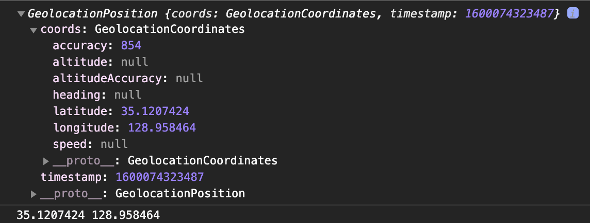

# Geolocation API  

### `geolocation` 객체
Geolocation API는 `window.navigator` 객체를 통해서 사용할 수 있음 
`geolocation`객체가 존재하는 경우 위치 정보 서비스를 지원함

### 현재 위치 가져오기
`getCurrentPosition()` 메서드를 호출해서 사용해서 사용자의 현재 위치를 가져옴  
* `getCurrentPosition()` 메서드의 반환 값

|속성|반환 값|
|:--:|:---:|
|`coords.latitude`|위도|
|`coords.longitude`|경도|
|`coords.accuracy`|위도 값과 경도 값의 정확도|
|`coords.altitude`|고도|
|`coords.altitudeAccuracy`|고도 값의 정확도|
|`timestamp`|위치 정보를 가져온 시간을 나타냄|

### 코드
    function getLocation() {
      // geolocation 객체가 존재하는 경우
      if (navigator.geolocation) {
        // 현재위치를 가져옴
        navigator.geolocation.getCurrentPosition(
          (position) => {
            console.log(position)
            // arr.push({ lat: position.coords.latitude, long: position.coords.longitude })
            // 현재 위치의 위도 경도 출력
            console.log(`${position.coords.latitude} ${position.coords.longitude}`)
          },
          (err) => {
            console.error(err)
          },
          {
            enableHighAccuracy: false,
            maximumAge: 0,
            timeout: Infinity,
          }
        )
      } else {
        console.log('GPS를 지원하지 않습니다.')
      }
    }
    
    getLocation()

### 콘솔 결과

