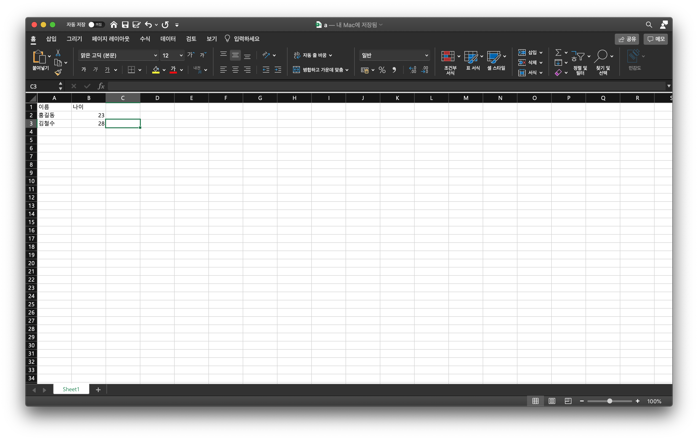
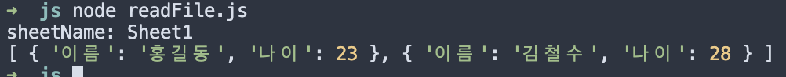

# readXLSX

- 서버측의 기술없이 [sheet.js](https://github.com/SheetJS/sheetjs)에서 만든 xlsx모듈을 이용하여 자바스크립트에서 엑셀 파일을 읽는 코드 정리

## xlsx설치

    $ npm i xlsx

## 코드

    const fs = require('fs')
    const XLSX = require('xlsx')

    let buf = fs.readFileSync('test.xls')
    let wb = XLSX.read(buf, { type: 'buffer' })

    wb.SheetNames.forEach((sheetName) => {
        console.log('sheetName: ' + sheetName)

        let rows = XLSX.utils.sheet_to_json(wb.Sheets[sheetName])
        console.log(rows)
    })

## Result
    아래의 사진과 같이 엑셀 파일이 json으로 변환돼서 출력을 하는 것을 볼 수 있음

|  |
| ----------------------------------------------------- | 
|  |

