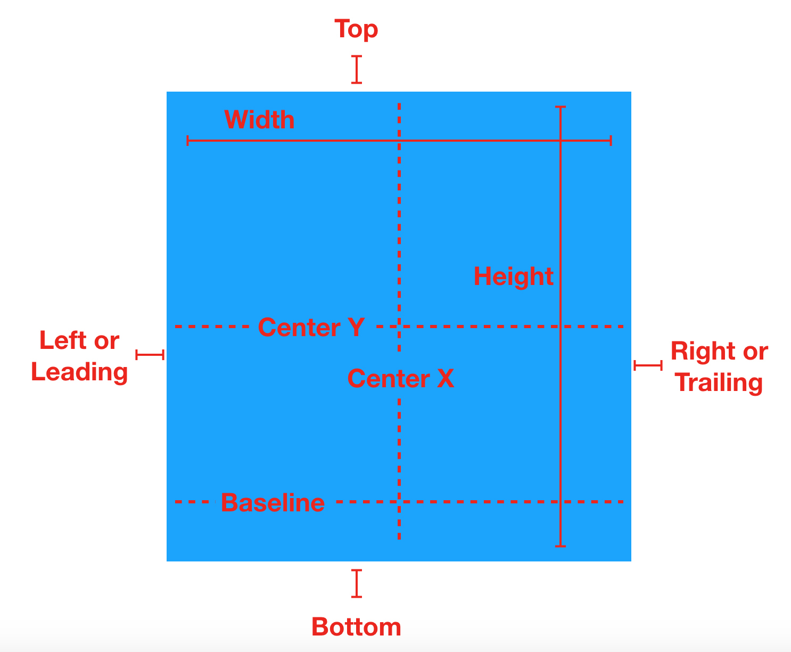
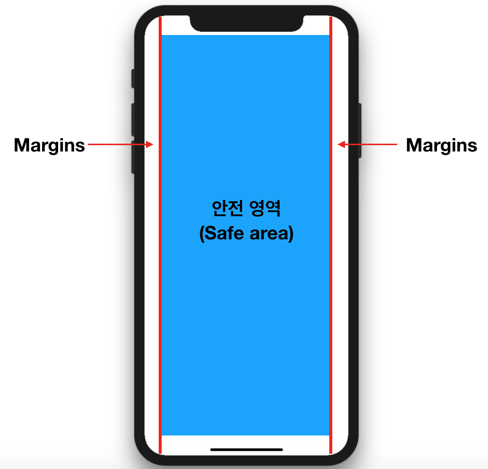
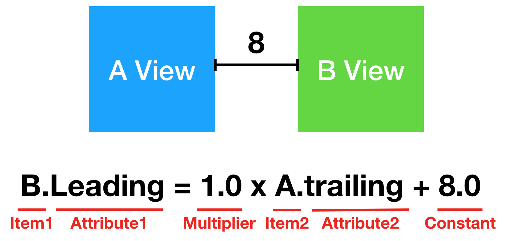
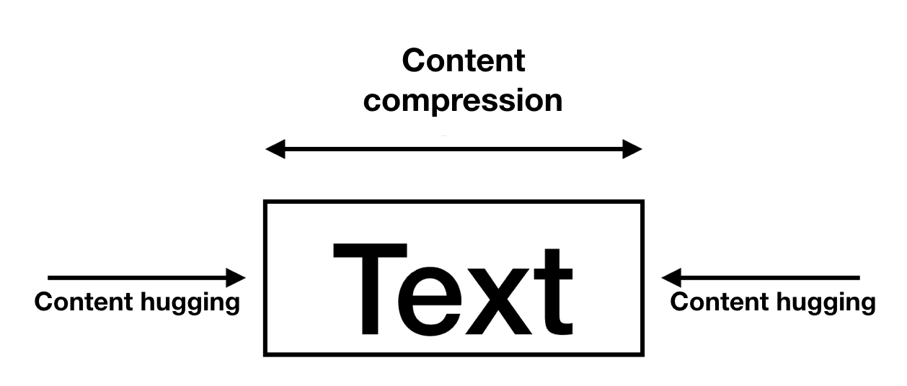

# 오토레이아웃

### 오토레이아웃
- `오토레이아웃`은 뷰의 제약 사항을 바탕으로 뷰 체계 내의 모든 뷰의 크기와 위치를 동적으로 계산함
- 외부 변경(External Changes)
  - 슈퍼뷰의 크기나 모양이 변경될 때 발생
  - 외부 변경이 발생하는 경우
    - 사용자가 아이패드의 분할뷰(Split View)를 사용하거나 사용하지 않는 경우
    - 장치를 회전하는 경우
    - 활성화콜과 오디오 녹음 바가 보여지거나 사라지는 경우
    - 다른 크기의 클래스를 지원하기 원하는 경우
    - 다른 크기의 스크린을 지원하기 원하는 경우
- 내부 변경(Internal Changes)
  - 사용자 인터페이스의 뷰의 크기 또는 설정이 변경되었을 때 발생
  - 내부 변경이 발생하는 경우
    - 애플리케이션 변경에 의해 콘텐츠가 보여지는 경우
    - 애플리케이션이 국제화를 지원하는 경우
    - 애플리케이션이 동적 타입을 지원하는 경우

### 오토레이아웃 속성
- 오토레이아웃 속성은 정렬 사각형을 기반으로 함

- `Width` : 정렬 사각형의 너비
- `Height` : 정렬 사각형의 높이
- `Top` : 정렬 사각형의 상단
- `Bottom` : 정렬 사각형의 하단
- `Baseline` : 텍스트의 하단
- `Horizontal` : 수평
- `Vertical` : 수직
- `Leading` : 리딩, 텍스트를 읽을 때 시작 방향
- `Trailing` : 트레일링, 텍스트를 읽을 때 끝 방향
- `CenterX` : 수평 중심
- `CenterY` : 수직 중심
  
### 안전 영역(Safe Area)
- 안전 영역은 콘텐츠가 상태바, 내비게이션 바, 툴바, 탭바를 가리는 것을 방지하는 영역

- 안전 영역 레이아웃 가이드는 `UIView` 클래스의 `var safaAreaLayoutGuide: UILayoutGuide`로 접근할 수 있음

### 제약
- 제약은 뷰 스스로 또는 뷰 사이의 관계를 속성을 통하여 정의

- Item1 : 방정식에 있는 첫 번째 아이템(B View) 입니다. 첫 번째 아이템은 반드시 뷰 또는 레이아웃 가이드이어야 합니다.
- Attribute1 : 첫번째 아이템에 대한 속성입니다. 이 경우, B View의 리딩입니다.
- Multiplier : 속성 2에 곱해지는 값입니다. 이 경우 1.0 입니다.
- Item2 : 방정식에 있는 두 번째 아이템(A View) 입니다.
- Attribute2 : 두번째 아이템에 대한 속성입니다. 이 경우, A View의 트레일링입니다.
- Constant : 두번째 아이템의 속성에 더해지는 상수 값입니다.

### 고유 콘텐츠 크기(Intrinsic Content Size)
- 뷰의 고유 콘텐츠 크기는 뷰가 갖는 원래의 크기

### 제약 우선도(Constraint Priorities)
- 우선도가 높을수록 다른 제약보다 우선적으로 레이아웃에 적용하며, 같은 속성의 다른 제약과 경합하는 경우, 우선도가 낮은 제약은 무시됨
  - 콘텐츠 허깅 우선도(Content hugging priority)
    - 콘텐츠 고유 사이즈보다 뷰가 커지지 않도록 제한
    - 다른 제약사항보다 우선도가 높으면 뷰가 콘텐츠 사이즈보다 커지지 않음
  - 콘텐츠 축소 방지 우선도(Content compression resistance priority)
    - 콘텐츠 고유 사이즈보다 뷰가 작아지지 않도록 제한
    - 다른 제약사항보다 우선도가 높으면 뷰가 콘텐츠 사이즈보다 작아지지 않음

### 레이아웃 마진
- 뷰에 콘텐츠 내용을 레이아웃할 때 사용하는 기본 간격
  - 레이아웃 마진 가이드(Layout Margins Guide) : 레이아웃 마진에 따라 형성되는 사각의 프레임 영역

### 앵커(Anchor)
- 오토레이아웃을 코딩하여 구현하여 제약을 만들기 위해 앵커를 사용할 수 있음
- 앵커와 관련된 프로퍼티

        var constraints: [NSLayoutConstraint]
        // 뷰에 부여한 제약사항들은 담은 배열

        var bottomAnchor: NSLayoutYAxisAnchor { get }
        // 뷰 프레임의 하단부 레이아웃 앵커

        var centerXAnchor: NSLayoutXAxisAnchor { get }
        // 뷰 프레임의 수평 중심부 레이아웃 앵커

        var centerYAnchor: NSLayoutYAxisAnchor { get }
        // 뷰 프레임의 수직 중심부 레이아웃 앵커

        var heightAnchor: NSLayoutDimension { get }
        // 뷰 프레임의 높이를 가리키는 레이아웃 앵커

        var leadingAnchor: NSLayoutXAxisAnchor { get }
        // 뷰 프레임의 리딩을 가리키는 레이아웃 앵커

        var topAnchor: NSLayoutYAxisAnchor { get }
        // 뷰 프레임의 상단부 레이아웃 앵커

        var trailingAnchor: NSLayoutXAxisAnchor { get }
        // 뷰 프레임의 트레일링을 가리키는 레이아웃 앵커

        var widthAnchor: NSLayoutDimension { get }
        // 뷰 프레임의 넓이를 가리키는 레이아웃 앵커