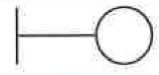
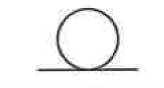
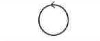

# 3. 분석 모델 확인하기

* 분석 모델 검증 방법
  * 유스케이스 모델 검증
  * 개념 수준의 분석 클래스 검증
  * 분석 클래스 검증
* 분석 클래스의 스테레오 타입
  역할구분|스테레오 타입| 내용
  ---|:---:|---
  경계||시스템과 외부 액터와의 상호작용을 담당하는 클래스
  엔티티||시스템이 유지해야하는 정보를 관리하는 기능을 전담하는 클래스
  제어||시스템이 제공하는 기능의 로직 및 제어를 담당하는 클래스
* 분석 모델의 시스템화 타당성 분석 프로세스
  * 타당성 검토의견 컬럼 추가
  * 타당성 검토의견 작성
  * 타당성 분석 결과 검증
  * 타당성 분석 결과 확인 및 배포/공유

# 키워드
* 엑터
  * 시스템의 외부에 있고, 시스템과 상호작용을 하는 사람